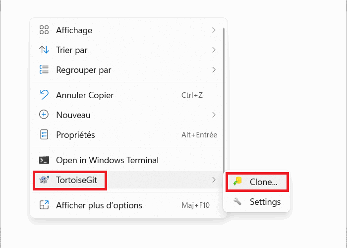

# Auteur

Je suis **Gérard KESSE**,  
Ingénieur en Développement Informatique **C/C++/Qt**, Avec à la fois des compétences en **Système Embarqué** et en **Robotique**. Formé à **Polytech'Montpellier**, Je suis un professionnel de conception de projets logiciel applicatif ou embarqué dans les secteurs de l'**Aéronautique**, de la **Robotique**, des **Drones** et de la **Vision par Ordinateur**. Aussi, Je reste ouvert à d'autres types de secteurs tels que l'**Energie** et les **Finances**.

Pour prendre contact avec moi :

* Site Web : [ReadyDev](http://readydev.ovh "Accéder à mon site web (ReadyDev)")
* Email : [tiakagerard@hotmail.com](mailto:tiakagerard@hotmail.com?subject=Contact&body=Bonjour "Me contacter par email")
* LinkedIn : [https://www.linkedin.com/in/tia-gerard-kesse/](https://www.linkedin.com/in/tia-gerard-kesse/ "Me contacter par LinkedIn (Gerard KESSE)")
* Localité : **Strasbourg - France**

Sommaire :

* [Contenu](https://github.com/gkesse/ReadyCode)
* [Apprendre TortoiseGit](#apprendre-tortoisegit)
* [Installer TortoiseGit sous Windows](#installer-tortoisegit-sous-windows)
* [Cloner un dépôt Git](#cloner-un-depot-git)

# Apprendre TortoiseGit

Dans ce tutoriel, nous utiliserons **Git** comme système de gestion de versions de projets,
**Notepad++** comme éditeur de texte par défaut de **Git**
et **TortoiseGit** comme interface graphique de gestion de versions de projets via **Git**.

# Installer TortoiseGit sous Windows

* Télécharger et Installer **Notepad++**  
[https://notepad-plus-plus.org/downloads/](https://notepad-plus-plus.org/downloads/)  
  
* Télécharger et Installer **Git**  
[https://git-scm.com/downloads](https://git-scm.com/downloads)  
  
* Télécharger et Installer **TortoiseGit**  
[https://tortoisegit.org/download/](https://tortoisegit.org/download/)  

# Cloner un dépôt Git

